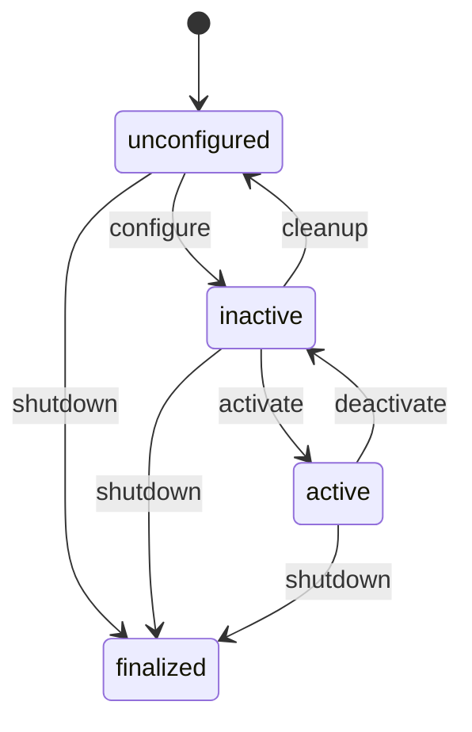
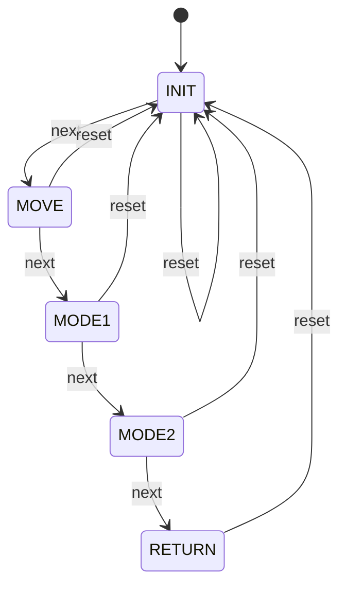
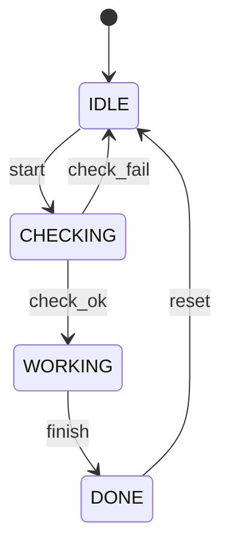

[](https://deepwiki.com/mtakemi/ros2_template_py)

# ros2_template_py


## ビルド

```bash
cd ~/unitree_ws
colcon build --packages-select ros2_template_py
source install/setup.bash
```


## 実行方法

```bash

ros2 run ros2_template_py simple_publisher

ros2 run ros2_template_py simple_subscriber

ros2 launch ros2_template_py lifecycle_pubsub.launch.py

```

## lifecycle_* 状態遷移図

`ros2_template_py/lifecycle_*` の状態遷移は以下です。



使用コマンド例:

```bash
ros2 lifecycle set /lifecycle_publisher activate
ros2 lifecycle set /lifecycle_publisher deactivate
ros2 lifecycle set /lifecycle_publisher cleanup
ros2 lifecycle set /lifecycle_publisher shutdown
ros2 lifecycle get /lifecycle_publisher
```


## state_machine_node 状態遷移図

`ros2_template_py/state_machine_node.py` の状態遷移は以下です。



使用コマンド例:

```bash
ros2 service call /state_machine_node/next std_srvs/srv/Trigger "{}"
ros2 service call /state_machine_node/reset std_srvs/srv/Trigger "{}"
ros2 param set /state_machine_node target_state MODE2
```

## sm_example_node 状態遷移図

`ros2_template_py/sm_example_node.py` の状態遷移は以下です。



使用トリガ例:

```bash
ros2 param set /sm_example_node fire_trigger start
ros2 param set /sm_example_node fire_trigger finish
ros2 param set /sm_example_node fire_trigger reset
```

